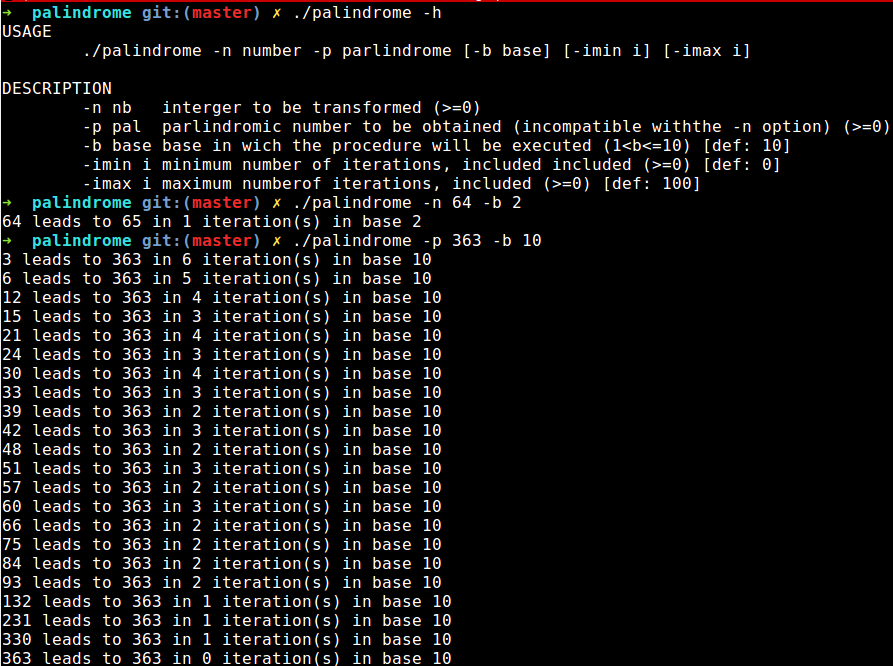

# Palindrome
Epitech first year project : Palindrome

Deadline : 5 days

Beginning of the project : 16/06/2016, 08h00

Group size : 1 person

# Palindrome

A palindrome is a word or a number which reads the same backward or forward (that is for numbers, numbers invariant when reversed).

A n-iteration turnover palindrome is a number which leads to a palindrome after n-iterations of the following procedure:

1. reverse the number,

2. add both the number and its reversal to obtain a new number,

3. iterate from the first step until you get a palindromic number.

For instance: 121 is a 0-iteration turnover palindrome, 123 is a 1-iteration reversal palindrome and 4782 is a 3-iteration turnover palindrome.

The goal of this project is to find such iterated reversal palindromes, and the smallest number of iterations, in order to get a palindromic number, given the constraints on this number of iterations

* [Palindrome](https://en.wikipedia.org/wiki/Palindrome)

## Getting started

These instructions will allow you to obtain a copy of the operational project on your local machine for development and testing purposes.

### Prerequisites

What do you need to install the software and how to install it?

```
gcc
make
```

### Installation

Here's how to start the project on your computer

Clone and go in the directory Palindrome

Project compilation

```
make
```

Running project

```
./palindrome -h
```


## Screenshot



## Build with

* [C](https://en.wikipedia.org/wiki/C_(programming_language))

## Auteurs

* **David Munoz** - [DavidMunoz-dev](https://github.com/davidmunoz-dev)
